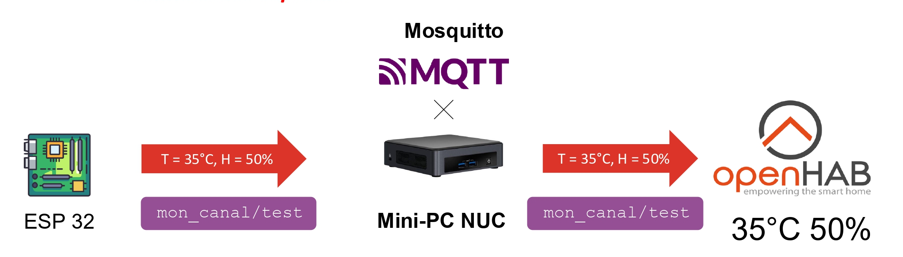

# 📡 Protocoles de communication

Dans le cadre de notre projet de domotique au MakerSpace, nous avons mis en place une communication entre les différents composants du système en utilisant une architecture distribuée basée sur des protocoles standards adaptés à l'Internet des Objets (IoT). Le choix de ces protocoles a été guidé par des critères tels que la fiabilité, la légèreté, la compatibilité avec l'ESP32 et la nécessité d'une communication en temps réel entre les capteurs et la plateforme domotique.

### Wi-Fi

En exploitant la connectivité Wi-Fi intégrée du microcontrôleur ESP32, nous avons opté pour ce protocole afin de connecter les capteurs au réseau local du MakerSpace. Le Wi-Fi offre une couverture adéquate pour l'ensemble des locaux, ainsi qu'une vitesse de transmission adaptée à l'envoi régulier des données des capteurs.

En tirant parti du réseau Wi-Fi interne du MakerSpace, nous avons pu connecter tous les capteurs à ce réseau et héberger le serveur domotique (OpenHab) ainsi que le broker MQTT (Mosquitto) sur un Intel NUC connecté à ce même réseau.

Chaque ESP32 se connecte automatiquement au réseau dès sa mise en marche, simplifiant ainsi le déploiement et la maintenance des dispositifs.

### MQTT

Le protocole MQTT (Message Queuing Telemetry Transport) occupe une place centrale dans notre système de communication. Léger et basé sur le modèle publish/subscribe, il convient parfaitement aux objets connectés.

Nous avons déployé un broker MQTT Mosquitto sur un NUC local (Intel NUC), qui héberge également le serveur OpenHab. Les capteurs ESP32 publient leurs données sur des topics spécifiques (par exemple : `makerspace/salle1/temperature`) et OpenHab les utilise pour les traiter, les stocker ou les afficher.

Les capteurs envoient des messages au format JSON, un format léger, structuré et largement pris en charge. Cette méthode permet de transmettre diverses valeurs ou métadonnées dans un unique message, ce qui facilite les évolutions futures.

Exemple de message publié :
```json
{
  "valeur": 23.5,
  "unite": "°C",
  "timestamp": "2025-06-08T15:42:10Z"
}
```

---

# 🔗 Intégration des capteurs au système domotique

Après avoir établi la communication via MQTT, la prochaine étape consiste à intégrer de manière efficace les données collectées par les capteurs dans la plateforme domotique choisie, à savoir OpenHab. Cette intégration permet l'utilisation des mesures dans des scénarios domotiques, des tableaux de bord ou des alertes.

### Configuration du broker MQTT dans OpenHab

La configuration du broker MQTT dans OpenHab se fait nativement en installant l'extension "MQTT Binding". Dans notre projet, nous avons configuré OpenHab pour se connecter au broker Mosquitto installé localement sur le NUC. Pour cela, un "MQTT Broker Thing" a été ajouté dans OpenHab avec les paramètres suivants : 
- Adresse du broker : `adresse IP du NUC`
- Port : `8080`

### Déclaration des capteurs (Things)

Cette étape établit la connexion entre OpenHab et le flux de données MQTT.

Chaque capteur est représenté dans OpenHab par un **Thing** de type MQTT. Chaque Thing regroupe un ou plusieurs Channels, correspondant à une donnée mesurée. 

Par exemple, pour un capteur de température dans le PrinterLAB, un Thing est défini avec un Channel lié au topic : `makerspace/printerlab/temperature`. 

Le Channel est configuré pour recevoir un message JSON, et un "transformateur" peut être utilisé pour extraire la donnée pertinente, par exemple : `JSONPATH:$.valeur`

### Liaison avec les Items

Ensuite, les Channels sont liés à des Items, représentant les données dans l'interface d'OpenHab. Chaque Item peut être utilisé pour afficher une valeur sur un tableau de bord, lancer une automatisation ou déclencher une alerte.

Une fois les Items configurés, les données des capteurs sont disponibles dans l'interface OpenHab sous forme de graphiques, jauges ou valeurs numériques simples.

---

# 🧭 Schéma de communication avec le protocole MQTT

## 
