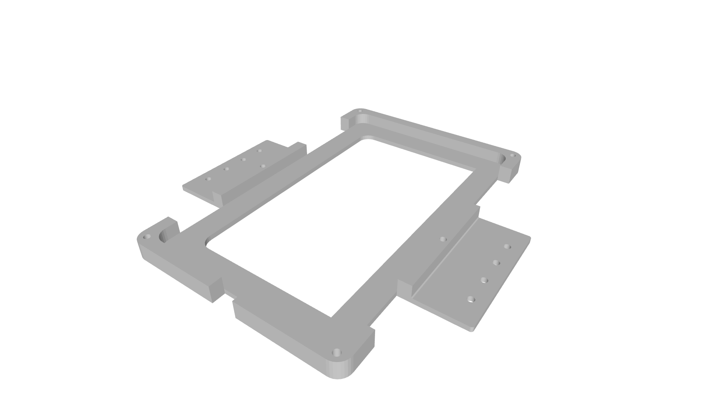
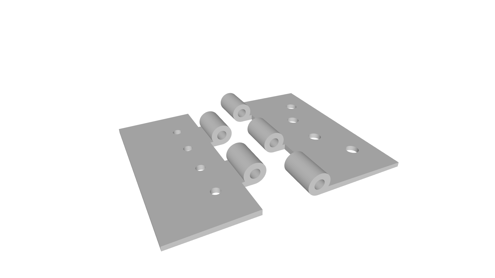
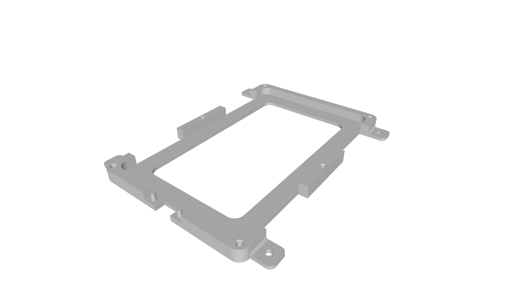
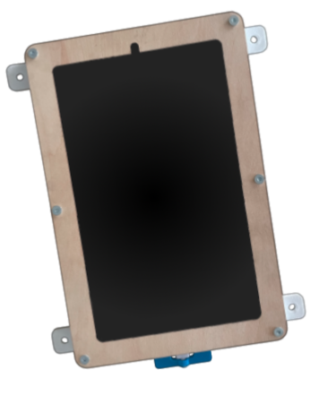
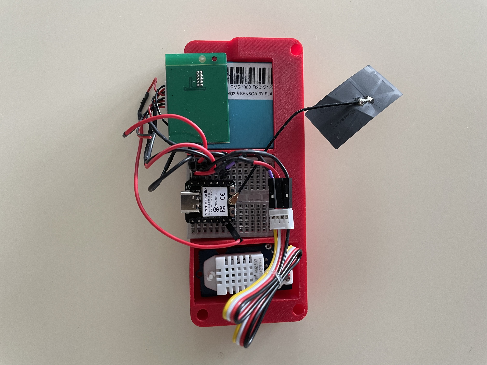

# 🛠️ Installation des capteurs et des écrans

L'installation des équipements physiques dans le MakerSpace a été soumise à plusieurs ajustements afin d'assurer la stabilité, l'esthétique et l'accessibilité des dispositifs.

Pour le support de la tablette, un système de charnière a été conçu pour la Samsung Galaxy Tab S6 Lite, fixé à une poutre en bois pour permettre le pivotement de la tablette. Cependant, le poids de la tablette s'est avéré trop important, causant une instabilité. Par conséquent, un support mural fixe plus robuste a été installé pour un usage quotidien optimal.

Premier modèle venant se fixer à la charnière.

Charnière.

Voici le support final. Il vient se fixer au mur, un cadre en bois permet de maintenir la tablette et un antivol pour le chargeur est présent.

En ce qui concerne l'affichage via le Raspberry Pi 3, un support imprimé en PLA conforme à la norme VESA a été utilisé pour fixer solidement l'écran HDMI à l'appareil, permettant la dissimulation de la Raspberry Pi et assurant une ventilation adéquate. Ce point d'affichage fixe et autonome est configuré pour afficher en plein écran le tableau de bord du serveur domotique.

Pour regrouper temporairement le microcontrôleur Seeed Studio XIAO, un capteur de qualité de l'air et un capteur de température et d'humidité, un boîtier temporaire imprimé en PLA a été conçu en attendant la fabrication d'un circuit imprimé finalisé. Ce boîtier facilite l'intégration provisoire de ces composants sur le site tout en offrant une protection mécanique et une facilité d'entretien.

Ces premières étapes de déploiement ont permis de valider l'installation dans l'environnement réel, en prévision d'une version plus définitive à venir avec l'intégration complète sur PCB.

---
