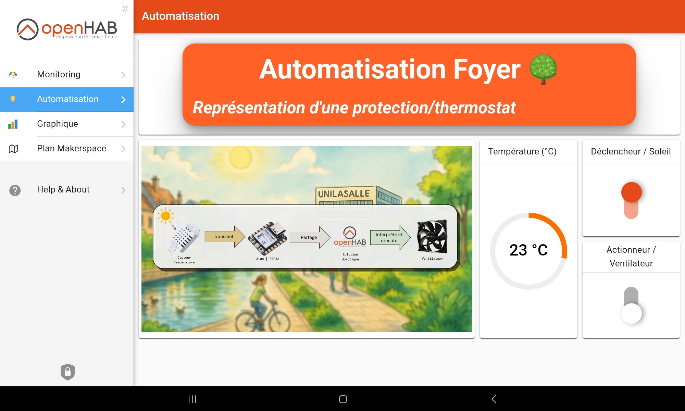
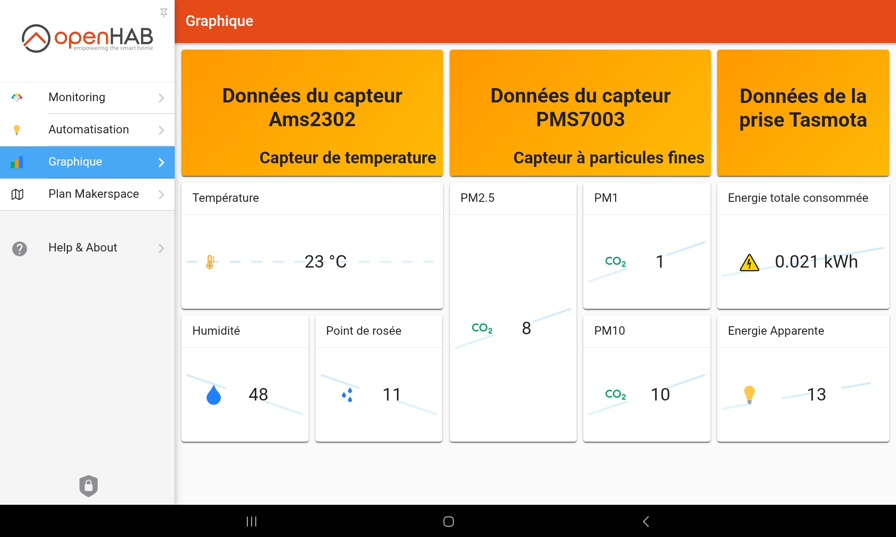
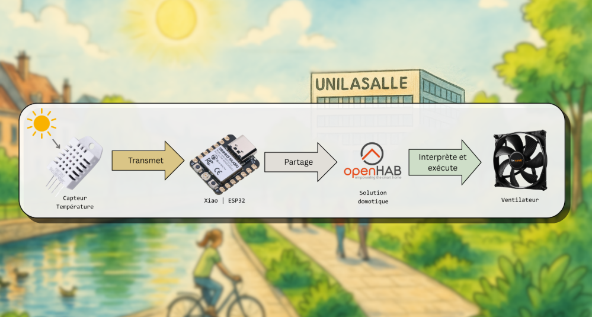

## 🔌 6.1 Programmation des ESP32 avec Tasmota

🧠 Cette section décrit comment nous avons préparé les microcontrôleurs **ESP32-C3 (XIAO Seeed Studio)** avec le firmware **Tasmota**, afin de connecter des capteurs, configurer le Wi-Fi, et publier les données via **MQTT**.

---

### 🔧 Microcontrôleur utilisé : XIAO ESP32-C3 (Seeed Studio)

Le microcontrôleur **XIAO ESP32-C3** est compact, économique, doté d’une connectivité Wi-Fi, et parfaitement adapté à l’environnement Tasmota. Il est alimenté via **USB-C**, ce qui facilite la configuration initiale depuis un ordinateur.
<p align="center">
  
</p>

### 💻 Installation de Tasmota

Nous avons utilisé le firmware officiel **Tasmota** spécialement compilé pour les ESP32-C3. Il s'agit du fichier :

**`tasmota32c3.factory.bin`**

🔗 Lien de téléchargement direct :
👉 [tasmota32c3.factory.bin (OTA)](https://ota.tasmota.com/tasmota32/release/tasmota32c3.factory.bin)

Ce fichier est une **version d’usine** du firmware Tasmota. Il contient le bootloader et la configuration initiale pour permettre à l’ESP32-C3 de démarrer directement dans un environnement prêt à l’emploi. Ce firmware est indispensable pour un premier flash.

---

#### 1. Effacement de la mémoire flash

Branchez le XIAO ESP32-C3 via USB, puis exécutez dans un terminal :

```bash
python -m esptool --chip esp32c3 --port COMx erase_flash
```

> Remplacez `COMx` par le port série utilisé (ex. `COM3` sous Windows ou `/dev/ttyUSB0` sous Linux).

#### 2. Flash du firmware Tasmota

Installez ensuite `tasmota32c3.factory.bin` :

```bash
python -m esptool --chip esp32c3 --port COMx write_flash -z 0x0 tasmota32c3.factory.bin
```

> 💡 Téléchargez le fichier depuis le lien ci-dessus et placez-le dans le dossier courant, ou indiquez son chemin complet.

---

### 📱 Configuration initiale de Tasmota

Dès que le module redémarre :

#### 1. Connexion au Wi-Fi de Tasmota

Un réseau Wi-Fi temporaire est généré (type `tasmota_XXXXXX`). Connectez-vous depuis un ordinateur ou un smartphone.

#### 2. Configuration du Wi-Fi

L’interface s’ouvre automatiquement (ou via `192.168.4.1`) pour entrer les identifiants du Wi-Fi du MakerSpace.

Une fois connecté, le module rejoint le réseau local et se voit attribuer une adresse IP.

---
<p align="center">
  
</p>


### 📡 Configuration MQTT dans Tasmota

Accédez à l’interface Tasmota via l’IP attribuée, puis allez dans `Configuration > Configure MQTT` et remplissez :

- **Host** : `172.16.4.33` (adresse IP du broker MQTT)
- **Port** : `1883`
- **Client** : `esp32c3-capteur` (nom unique)
- **Topic** : `capteur`
- **User / Password** : *(laisser vide si non requis)*
<p align="center">
  
</p>

### 📎 Affectation des capteurs sur les GPIO

Dans `Configuration > Configure Module`, choisissez **Module Generic (18)**, puis assignez les GPIO aux capteurs connectés.

#### 🔹 AMS2302 (température & humidité)

- Capteur branché sur **GPIO10**
- Type dans Tasmota : **AM2301**

| Fonction    | GPIO   | Remarque                                  |
|-------------|--------|-------------------------------------------|
| Data        | GPIO10 | Un seul fil de données (1 fil + GND + VCC) |

#### 🔹 PMS7003 (particules fines PM1.0 / PM2.5 / PM10)

Ce capteur UART est compatible avec **PMS5003** dans Tasmota :

| Fonction      | GPIO    | Remarque                          |
|---------------|---------|-----------------------------------|
| TX (capteur)  | GPIO20  | → RX de l’ESP32                   |
| RX (capteur)  | GPIO21  | ← TX de l’ESP32                   |

---

### 🧪 Vérification du fonctionnement

Les messages MQTT peuvent être lus via **MQTT Explorer**, ou intégrés dans **OpenHab** ou **Home Assistant**.

#### Exemple de message JSON publié :

```json
{
  "Time": "2025-06-13T12:07:23",
  "AM2301": {
    "Temperature": 24.7,
    "Humidity": 49.5
  },
  "PMS5003": {
    "PM1.0": 6,
    "PM2.5": 10,
    "PM10": 14
  }
}
```

✅ Grâce à Tasmota, l’ESP32-C3 publie les données des capteurs en temps réel sans écrire de code, ce qui simplifie et fiabilise le déploiement dans le MakerSpace.


## ⚙️ 6.2 Configuration de la solution domotique avec OpenHab

🧠 Nous avons utilisé **OpenHab** comme plateforme domotique pour centraliser les données des capteurs Tasmota et mettre en place des automatisations.

> Cette partie suppose que vous avez **déjà installé OpenHab sur le NUC** à l’aide de Docker, selon le tutoriel d’installation fourni précédemment.

---

### 🧱 Architecture

- **Microcontrôleurs** : ESP32-C3 avec Tasmota
- **Protocole** : MQTT
- **Broker** : Mosquitto (installé sur le même NUC que OpenHab)
- **Serveur domotique** : OpenHab (en conteneur Docker)

---

### 1️⃣ Préparation côté Tasmota

Avant de configurer OpenHab, assurez-vous que votre ESP32-C3 :

- est connecté au Wi-Fi du MakerSpace
- publie les données MQTT correctement vers le broker (`172.16.4.33`)
- a un **Topic** unique (par exemple : `capteur`)

👉 Voir la section **6.1 Programmation des ESP32 avec Tasmota** pour plus de détails sur cette configuration.

---

### 2️⃣ Ajouter le binding MQTT dans OpenHab

1. Connectez-vous à l'interface Web d’OpenHab (`http://<IP_NUC>:8080`)
2. Allez dans **Paramètres > Add-ons > Bindings**
3. Recherchez **MQTT Binding**
4. Cliquez sur **Install**

---

### 3️⃣ Configurer le broker MQTT dans OpenHab

1. Allez dans **Paramètres > Things**
2. Cliquez sur **+ Ajouter un Thing**
3. Choisissez **MQTT Broker**
4. Remplissez les champs suivants :

| Champ           | Valeur                  |
|-----------------|--------------------------|
| Name            | Mosquitto Broker         |
| Broker Address  | `tcp://172.16.4.33:1883` |
| Client ID       | openhab                  |
| Secure          | désactivé (non TLS)      |
| Authentication  | désactivée (si pas d’utilisateur) |

---

### 4️⃣ Ajouter un capteur Tasmota (MQTT Generic Thing)

Chaque ESP32-C3 (ou "capteur") est représenté dans OpenHab par un **Thing MQTT Generic**.

#### Exemple : capteur avec topic `capteur`

1. Allez dans **Paramètres > Things > + Ajouter un Thing**
2. Choisissez **Generic MQTT Thing**
3. Choisissez comme bridge le **Mosquitto Broker**
4. Remplissez :

| Champ            | Valeur     |
|------------------|------------|
| Thing ID         | capteur    |
| Label            | Capteur ESP32C3 |
| MQTT Base Topic  | `tele/capteur/SENSOR` |

> Ce chemin est celui utilisé par Tasmota pour publier les données de capteurs (topic `tele/.../SENSOR`).

---

### 5️⃣ Ajouter les channels (données du capteur)

Ajoutez ensuite les **Channels** correspondant aux données publiées dans le message JSON de Tasmota.

#### 💧 Température (AMS2302)

```json
{
  "Time": "2025-06-13T12:07:23",
  "AM2301": {
    "Temperature": 24.7,
    "Humidity": 49.5
  }
}
```

🔹 Pour récupérer la température :

- Type : Number
- Label : Température
- MQTT State Topic : `tele/capteur/SENSOR`
- Transformation : `JSONPATH:$.AM2301.Temperature`

🔹 Pour l’humidité :

- JSONPATH : `$.AM2301.Humidity`

---

#### 🌫️ Particules fines (PMS7003 détecté comme PMS5003)

```json
"PMS5003": {
  "PM1.0": 6,
  "PM2.5": 10,
  "PM10": 14
}
```

🔹 PM2.5 par exemple :

- Type : Number
- Label : Poussières PM2.5
- MQTT State Topic : `tele/capteur/SENSOR`
- Transformation : `JSONPATH:$.PMS5003["PM2.5"]`

> Les autres données (PM1.0, PM10) peuvent être ajoutées de la même manière.

---

### 6️⃣ Lier les channels à des Items

1. Une fois les channels ajoutés, cliquez sur **Créer un nouvel Item** pour chacun.
2. Choisissez un nom et une icône (ex. `temperature_cuisine`, icône : `temperature`).
3. Cochez "Visible dans le model" si vous voulez l’utiliser dans l’UI.

---

### 7️⃣ Visualisation dans l’interface utilisateur

- Allez dans **Pages > Ajouter un bloc**
- Sélectionnez **Élément de type Gauge**, **Stat**, ou **Line Chart**
- Choisissez l’Item correspondant (température, humidité, particules, etc.)

> Vous pouvez créer des dashboards personnalisés pour différentes zones du MakerSpace.

---

### 📚 Documentation officielle OpenHab

La documentation d’OpenHab est très complète et bien structurée. En cas de doute sur un binding, une syntaxe ou une règle :

🔗 [https://www.openhab.org/docs/](https://www.openhab.org/docs/)

Elle propose :

- des tutos pour débuter
- des guides pour les bindings comme MQTT
- des exemples complets de transformations JSON, règles, pages UI, etc.

---

✅ À ce stade, les données envoyées par Tasmota sont reçues, transformées, et affichées dans OpenHab, prêtes à être utilisées dans des scénarios d’automatisation (cf. section 6.3).


---

### 🏠 Exemple de dashboard créé sur OPENHAB pour la journée des projets




## 🤖 6.3 Automatisations et scénarios

Les **automatisations** sont au cœur de toute solution domotique : elles permettent de faire réagir le système à des événements en temps réel. Dans un lieu aussi actif que le **MakerSpace**, elles rendent l’environnement **plus intelligent, sécurisé et autonome**.

Par exemple, une automatisation peut :

- déclencher un ventilateur si le taux de CO₂ est trop élevé,
- couper le courant d’un outil s’il chauffe,
- allumer l’éclairage automatiquement en fonction de la présence.


  
---
### 🎯 Objectif de cette démonstration

Pendant notre journée de présentation dans le **foyer**, nous avons mis en place une **démo de sécurité thermique** afin de montrer en pratique l’utilité du **monitoring intelligent**.

> L’idée : **chauffer un capteur** avec un **sèche-cheveux branché sur une prise connectée**, et dès que la température dépasse **30°C**, une **règle dans OpenHab** :
>
> 1. Allume un **ventilateur branché sur une autre prise connectée** (Tasmota)
> 2. Éteint le **sèche-cheveux automatiquement** pour éviter toute surchauffe

Ce scénario simple illustre bien comment la domotique peut être utilisée **pour surveiller et protéger l’environnement du MakerSpace**.


---
## ⚙️ Mise en place de l’automatisation dans OpenHab

Nous allons créer une **règle conditionnelle** dans OpenHab qui surveille un capteur de température, et agit automatiquement si une température critique est atteinte.

---

### 🧪 Matériel utilisé

| Équipement         | Détail                                          |
|--------------------|--------------------------------------------------|
| ESP32-C3 (Tasmota) | avec capteur **AM2302**                          |
| Prise connectée 1  | Branchée au **sèche-cheveux**                   |
| Prise connectée 2  | Branchée au **ventilateur** (commandée via Tasmota) |
| Plateforme         | OpenHab via Docker (NUC)                        |

---

### 📐 Étape 1 : Préparer les Items dans OpenHab

Assurez-vous que les éléments suivants sont bien configurés et visibles dans OpenHab :

| Item                | Type     | Exemple              |
|---------------------|----------|-----------------------|
| `temp_foyer`        | Number   | Température du capteur |
| `prise_ventilo`     | Switch   | ON/OFF via Tasmota     |
| `prise_sechecheveux`| Switch   | ON/OFF via Tasmota     |

> Ces Items doivent être reliés aux topics MQTT correspondants (voir section 6.2).

---

### ⚙️ Étape 2 : Créer une règle dans l'interface Web

1. Accédez à OpenHab via navigateur → **http://<IP_NUC>:8080**
2. Menu **Settings > Rules**
3. Cliquez sur **+ Add Rule**

#### 📋 Paramètres de la règle

- **Name** : Sécurité thermique foyer
- **Description** : Coupe le sèche-cheveux et active un ventilateur si température > 30°C
- **When (déclencheur)** :
  - Type : **Item**
  - Item : `temp_foyer`
  - Trigger : **changes**
  - Condition : **greater than 30**

#### ⚡ Action 1 : Allumer le ventilateur

- Type : **Run a rule action**
- Choisir : **Item Action**
- Item : `prise_ventilo`
- Commande : `ON`

#### 🔌 Action 2 : Éteindre le sèche-cheveux

- Ajouter une autre action
- Item : `prise_sechecheveux`
- Commande : `OFF`

---

### ✅ Résultat attendu

Lorsque la température dépasse **30°C**, le système :

1. Allume automatiquement le ventilateur
2. Coupe l’alimentation du sèche-cheveux
3. Les actions sont visibles dans le journal d’événements d’OpenHab

Ce type de scénario peut ensuite être enrichi (temporisation, notifications, seuils ajustables, etc.).

---

### 📚 Documentation OpenHab

La documentation officielle est claire et bien organisée, notamment pour :

- la création de règles :
  👉 https://www.openhab.org/docs/automation/
- la transformation de données (JSON, MAP, REGEX) :
  👉 https://www.openhab.org/docs/configuration/transformations.html
- les bindings et configurations MQTT :
  👉 https://www.openhab.org/addons/bindings/mqtt/

---

🧠 Grâce à ce système, nous avons démontré que la domotique ne se limite pas à du confort, mais peut aussi **jouer un rôle de sécurité proactive** dans un environnement collectif comme un MakerSpace.

---
