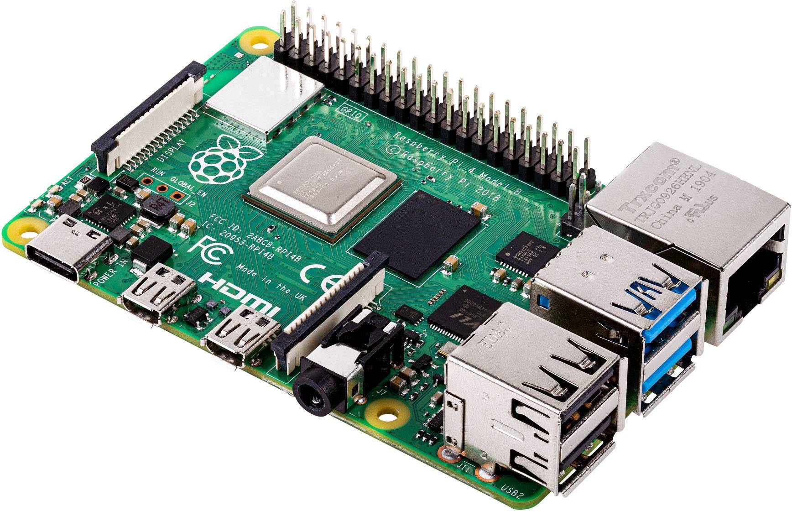
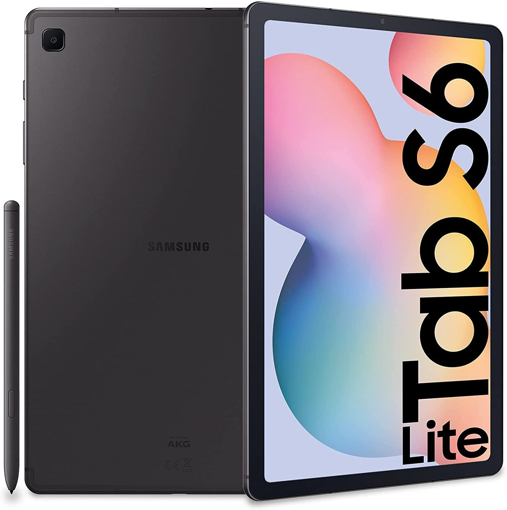

# 🖥️ Choix du matériel d’affichage

Dans le but de permettre la visualisation en temps réel des données provenant des capteurs, deux dispositifs d'affichage ont été déployés dans le MakerSpace.

Les dispositifs utilisés comprennent un Raspberry Pi 3 avec un écran HDMI, fixé à l'arrière de l'écran, configuré pour afficher automatiquement une page web hébergée par le serveur domotique. Cette configuration permet une visualisation continue et simple des indicateurs via un navigateur web en mode plein écran.

Une tablette Samsung Galaxy Tab S6 Lite, déjà présente dans le MakerSpace, a également été utilisée comme second point d'affichage. Connectée au même réseau local, elle permet un accès à l'interface web via le navigateur, offrant une flexibilité appréciable grâce à son autonomie et sa mobilité pour une consultation rapide du tableau de bord.

En complément du système domotique, ces deux supports d'affichage offrent un accès clair, intuitif et en temps réel aux informations collectées, améliorant ainsi l'efficacité globale de la visualisation des données.

---

# 🖱️ Conception du dashboard

La solution domotique sélectionnée pour ce projet est OpenHab, qui propose la création de tableaux de bord personnalisés appelés _Sitemaps_ ou _Pages UI_. Ces interfaces offrent une grande flexibilité dans la présentation des données et la navigation par pièce ou zone fonctionnelle.

L'organisation de l'interface a été pensée de manière logique selon les différentes pièces ou espaces du MakerSpace (par exemple : atelier électronique, salle des imprimantes 3D, espace détente), permettant ainsi une meilleure compréhension et un accès rapide aux données pertinentes pour chaque zone.

OpenHab propose une variété de composants graphiques pour enrichir l'interface, tels que des graphiques temporels, des barres de progression pour la consommation électrique, et des icônes dynamiques représentant l'état des capteurs ou des équipements. Cette modularité permet d'adapter le tableau de bord aux différents profils d'utilisateurs, allant du visiteur occasionnel au technicien de maintenance.

L'objectif principal de cette interface est de fournir une expérience utilisateur intuitive, contextualisée et visuellement claire, afin que chaque utilisateur puisse rapidement saisir l'état global du MakerSpace, pièce par pièce.

Example de dashboard.

---
