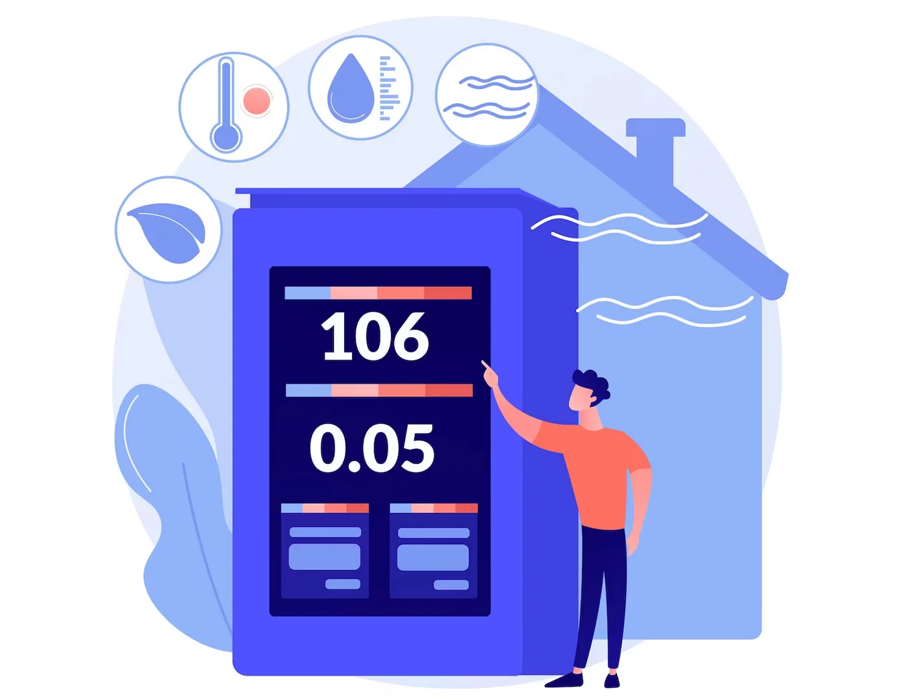

# 🧭 Contexte du projet

Un monitoring fait référence à l’ensemble des systèmes et dispositifs permettant de surveiller en temps réel les paramètres environnementaux, tels que la température, l’humidité ou la qualité de l’air.

Le MakerSpace est un espace partagé utilisé par des étudiants, des encadrants et des visiteurs, équipé de nombreux équipements en fonctionnement. Cependant, il manque actuellement un système de surveillance pour suivre ces conditions et optimiser l’utilisation de l’espace.

Ce projet a pour objectif de remédier à cette lacune en mettant en place un système de monitoring domotique, permettant de recueillir des données en temps réel et de faciliter la gestion de l’environnement pour les utilisateurs.

La domotique désigne l’utilisation de technologies pour automatiser et contrôler les systèmes et équipements d’un espace, tels que l’éclairage, le chauffage ou la gestion de l’énergie, souvent via des dispositifs connectés.

## 

---

# 🎯 Objectifs

Les objectifs principaux de ce projet consistent à déployer un système domotique dans le MakerSpace en vue de surveiller et de gérer les conditions de l'environnement en temps réel. 

Il s'agira également de concevoir des capteurs connectés permettant de mesurer la température, l'humidité et la qualité de l'air, et de les intégrer au système domotique. Une phase de test et de comparaison de plusieurs solutions domotiques open-source sera réalisée afin de sélectionner celle la mieux adaptée aux besoins du MakerSpace. Enfin, des tablettes seront installées pour présenter les données du monitoring et fournir des informations aux utilisateurs via un dashboard interactif. 

L'objectif global de ces actions est de mettre en place un système de monitoring efficace et accessible pour l'ensemble des utilisateurs du MakerSpace.

---

# 🧰 Présentation du MakerSpace

Le MakerSpace est un espace de co-conception et de prototypage intégré au sein d’UniLaSalle Amiens. Il est ouvert librement aux publics du campus, à savoir les étudiants et le personnel.

C’est un lieu de rencontre et d’apprentissage permettant à chacun de concevoir, fabriquer et partager ses projets. Il s’inscrit dans la lignée de la culture Maker et de la philosophie des FabLabs. À ce titre, la connaissance est partagée et l’autonomie est encouragée dans la réalisation des projets. Chacun peut travailler seul ou en groupe sur son propre sujet, qu’il soit personnel ou lié à l’activité de l’école.

Enfin, le MakerSpace est un outil pédagogique important pour la formation des étudiants. Il facilite la mise en œuvre des projets et soutient la vie étudiante ainsi que les clubs et associations du campus.

> *Définition tirée du site officiel du MakerSpace UniLaSalle Amiens :*  
> [https://makerspace-amiens.fr/pages/informations/](https://makerspace-amiens.fr/pages/informations/)

---

# 📚 Organisation du rapport

2. 📜 [**Introduction**](INTRODUCTION.md)  
L'introduction a pour objectif de présenter le projet "Monitoring du MakerSpace", de définir ses objectifs, ainsi que de situer le contexte et la portée du travail réalisé dans le cadre de cette étude.

3. 📝 [**Analyse des besoins et cahier des charges**](ANALYSE.md)    
Cette section expose les besoins fonctionnels et techniques du projet, les contraintes à respecter, ainsi que les profils des utilisateurs visés et leurs attentes.

4. 🧰 [**Étude des solutions domotiques open-source**](ETUDES.md)    
Cette partie révèle les résultats de l'analyse des solutions domotiques open-source testées, en incluant un tableau comparatif des critères tels que la compatibilité, l'ergonomie, et la documentation.

5. 🌡️ [**Conception des capteurs connectés**](CONCEPTION_CAPTEUR.md)  
Un point est fait sur le choix des capteurs et du microcontrôleur (ESP32), avec une présentation de l'architecture matérielle et des considérations pratiques d'intégration.

6. 📡 [**Communication et interconnexion**](COMMUNICATION.md)  
Cette section détaille les protocoles de communication utilisés pour l'intégration des capteurs au système domotique, ainsi que les aspects liés à la sécurité et à la fiabilité.

7. 💻 [**Développement logiciel**](DEV_LOG.md)  
Une explication précise est donnée sur le développement du programme pour les ESP32, la configuration de la solution domotique, ainsi que les procédures d'automatisation et de tests unitaires.

8. 🧩 [**Interface de visualisation et affichage**](INTERFACE.md)    
La conception de l'interface utilisateur pour l'affichage des données de monitoring est abordée, en mettant en avant les technologies utilisées et l'ergonomie.

9. 🏗️ [**Déploiement dans le MakerSpace**](DEPLOIEMENT.md)  
Il est question de l'installation des capteurs et des écrans dans le MakerSpace, des tests effectués sur place, des ajustements nécessaires et des retours des utilisateurs.

10. 📊 [**Bilan et perspectives**](BILAN.md)   
Un bilan est dressé, mettant en lumière les succès et les obstacles rencontrés, les leçons apprises et les pistes d'amélioration envisagées pour le futur développement du système.

---
