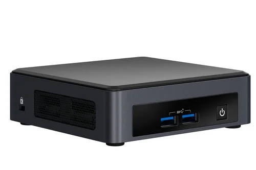

# Configuration du Mini-PC (NUC) 🖥️



Un NUC (Next Unit of Computing) est un mini-PC compact développé par Intel. Il offre des performances comparables à un ordinateur de bureau tout en occupant très peu d'espace. Les NUC sont souvent utilisés pour le multimédia, les serveurs domestiques et les applications industrielles.

Nous allons utiliser un NUC pour héberger la plateforme de domotique **OpenHAB**.

## 1. Téléchargement de la Dernière Version d'Ubuntu LTS 📝

Pour créer une clé USB bootable, la première étape consiste à télécharger la dernière version de **Ubuntu LTS** (Long Term Support).

- Télécharger l'image ISO de [**Ubuntu Desktop 24.04 LTS**](https://ubuntu.com/download/desktop) depuis le site officiel.

## 2. Création de la Clé USB Bootable avec Rufus 🛠️

**Rufus** permet de créer des clés USB bootables à partir d'images ISO.

- **Étapes :**
  1. Télécharger [**Rufus**](https://rufus.ie/) depuis son site officiel.
  2. Lancer Rufus et sélectionner l'image ISO d'Ubuntu téléchargée.
  3. Choisir la clé USB comme périphérique de destination.
  4. Démarrer pour créer la clé USB bootable.

## 3. Configuration du BIOS du NUC ⚙️

Pour démarrer à partir de la clé USB, il est nécessaire de configurer le BIOS du NUC.

- **Étapes :**
  1. Allumer le NUC et accéder au BIOS en appuyant sur la touche appropriée (dans notre cas : **F2**).
  2. Modifier l'ordre de démarrage pour prioriser le démarrage à partir de la clé USB.
  3. Sauvegarder les modifications et redémarrer le NUC.

## 4. Installation d'Ubuntu Desktop 24.04 LTS 💻

Une fois le NUC démarré à partir de la clé USB :

- **Étapes :**
  1. Suivre les instructions pour configurer l'OS.
  2. Installer Ubuntu sur le disque dur du NUC.

## 5. Installation de Docker pour Exécuter OpenHAB en Conteneur 🛥️

**Docker** permet de gérer des conteneurs logiciels. **OpenHAB** est une plateforme d'automatisation domestique.

- **Mettre à jour les paquets :**
  ```bash
  sudo apt update
  ```

- **Installer Docker :**
  ```bash
  sudo apt install docker.io
  ```

- **Créer un répertoire pour OpenHAB :**
  ```bash
  mkdir -p ~/openhab/{addons,conf,userdata}
  ```

- **Télécharger et exécuter l'image Docker d'OpenHAB :**
  ```bash
  docker run -d \
    --name openhab \
    --net=host \
    --restart=unless-stopped \
    -v ~/openhab/addons:/openhab/addons \
    -v ~/openhab/conf:/openhab/conf \
    -v ~/openhab/userdata:/openhab/userdata \
    -e USER_ID=$(id -u) \
    -e GROUP_ID=$(id -g) \
    -e OPENHAB_HTTP_PORT=8080 \
    -e OPENHAB_HTTPS_PORT=8443 \
    openhab/openhab:latest
  ```

- **Vérifier que le conteneur fonctionne :**
  ```bash
  docker ps
  ```

## 6. Connexion au NUC via son IP depuis les PC Portables 🌐

Pour accéder au NUC à distance, il faut connaître son adresse IP.

- **Étapes :**
  1. Trouver l'adresse IP du NUC :
     ```bash
     ip a
     ```
  2. Depuis un navigateur sur nos PC portables, entrer l'adresse IP du NUC suivie du port `8080` pour accéder au dashboard d'OpenHAB :
     ```bash
     http://<adresse_ip>:8080
     ```
