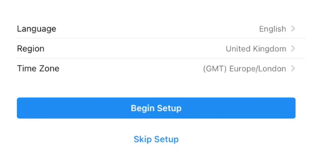
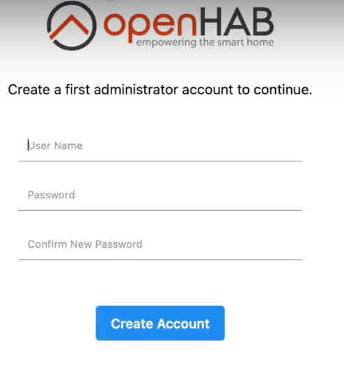
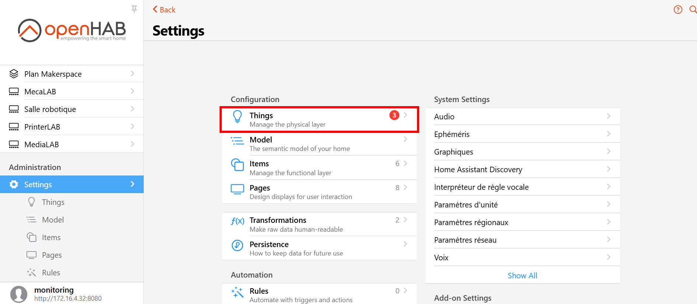
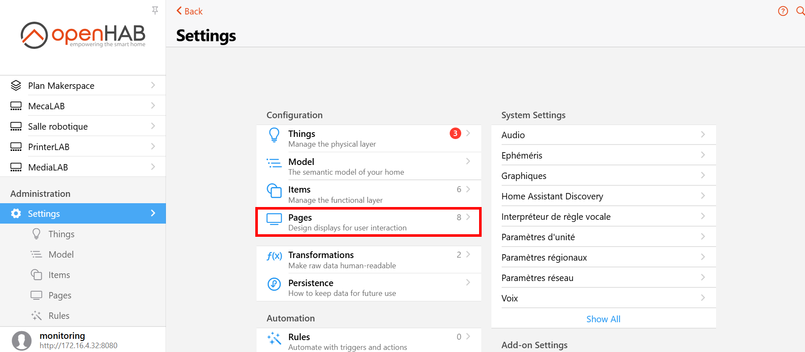
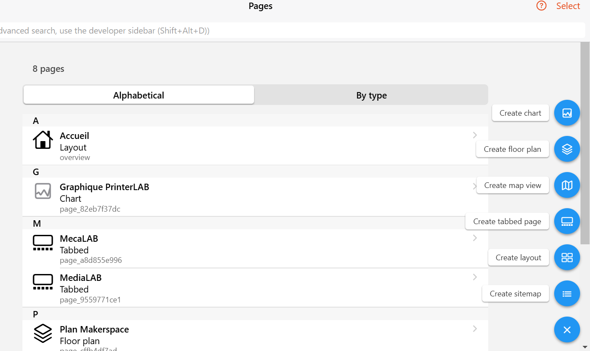

# Configuration OpenHAB 🏠


[OpenHAB](https://www.openhab.org/) (Open Home Automation Bus) est une plateforme open-source pour l'automatisation domestique. Une fois installé et accessible via le dashboard, voici comment configurer les fonctionnalités de base d'OpenHAB.

## 1. Accès au Dashboard OpenHAB 🌐

- **Étapes :**
  1. Ouvrir un navigateur web.
  2. Entrer l'adresse IP du NUC suivie du port `8080` :
     ```bash
     http://<adresse_ip>:8080
     ```

## 2. Configuration Initiale ⚙️

Lors de la première connexion, OpenHAB vous guidera à travers une configuration initiale.

- **Étapes :**
  1. Sélectionner la langue.

  2. Choisir un mot de passe administrateur.

  3. Configurer les paramètres régionaux (fuseau horaire, unité de mesure, etc.).

## 3. Ajout de Choses (Things) 📱

Les "Things" dans OpenHAB représentent les dispositifs physiques que vous souhaitez contrôler.

- **Étapes :**
  1. Aller dans **Configuration** > **Things**.

  2. Cliquer sur le bouton **+** pour ajouter une nouvelle chose.
  3. Sélectionner le type de dispositif (par exemple, Philips Hue, Z-Wave, etc.).
  4. Suivre les instructions spécifiques au dispositif pour l'ajouter.

## 4. Utilisation des Dashboards 📊

OpenHAB propose plusieurs dashboards pour visualiser et contrôler vos dispositifs.

- **Étapes :**
  1. Accéder aux pages via le menu principal
  
  2. Personnaliser les dashboards en ajoutant des widgets et des graphiques.
  
