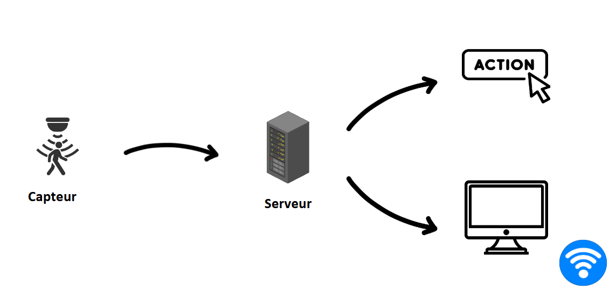

# Études et choix techniques

Durant le projet, nous avons fait beaucoup de choix techniques après une étude avancées de solutions déjà existantes. Dans cette partie nous détaillerons le cahier des charges, les alternatives que nous avons trouvé à tous les niveaux ainsi que la décision finale de chaque outil.

## Cahier des charges

Avant de commencer à se lancer dans la recherche de logiciel et de capteur il est important de savoir comment notre projet va fonctionner en établissant notre cahier des charges. Un élément essentiel à sa création et de visualiser le chemin de l'information.

Un ensemble de capteur sera installé dans les salles pour collecter des informations telles que la température et l'humidité. Une fois la donnée collectée il faudra l'envoyer à un serveur qui traitera l'information à l'aide d'une distribution de domotique, pour l'installation de la distribution OpenHab [**Cliquez ici**](config_Mini_PC.md). Enfin on choisit si on veut afficher cette information ou si on veut en faire une action dans le makerspace, par exemple baisser le chauffage si il fait trop chaud.

Les composants seront interconnectés à l'aide du wifi du Makerspace qui nous permet de diffuser nos données dans tout l'étage. 3 objectifs sont visibles dans le projet: l'installation doit être sécurisée pour éviter tout accident ou vol. Elle doit être aussi confortable autant pour les étudiants utilisant le système que les particpants du Makerspace voulant modifier le projet à l'aide de notre documentation. Et enfin le projet doit être économique à la fois dans l'objectif du projet (tracker des données pour faire des économies) que dans la réalisation (chaque projet a un budget de 250euros💵).

Le MakerSpace est composée de 4 salles principales que nous allons monitorer, on retrouve le PrinterLab, le MecaLab, Le MediaLab et enfin la salle de robotique. à l'aide de Adrien Bracq et Rémy nous avons réaliser un cahier des charges de chaque salle avec les informations principales que nous souhaitons récuperer. Toutes les informations sont répertoriées sur une carte mentale que vous pouvez lire [**en cliquant ici**](https://mm.tt/app/map/3664162986?t=CA8L0nF3uQ).

Comme vous pouvez le constater sur le schéma dans l'introduction le projet se scinde en 3 grandes parties qui seront présentes par la suite dans ce dossier, vous retrouverez dans chaque partie les différentes solutions, nos réflexions, une explication de nos choix et comment utiliser les technologies de notre projet.

- [**Les capteurs**](capteur.md)

- [**Le serveur**](config_Mini_PC.md)

- [**OpenHab**](initialisation_OpenHAB.md)

- [**Affichage**](affichage.md)
