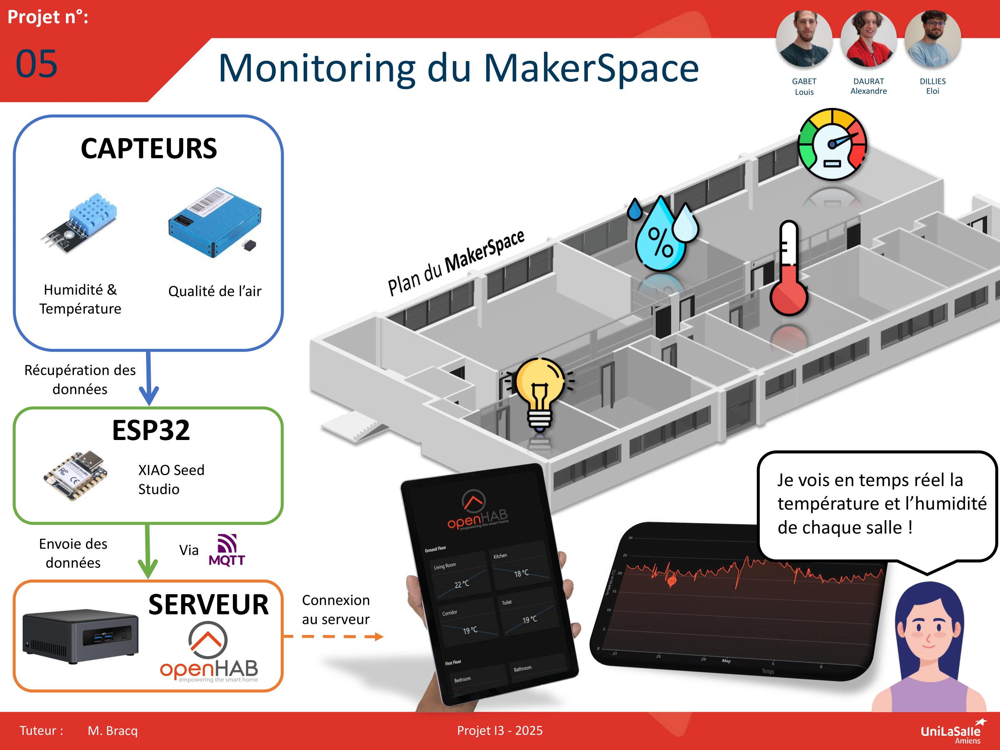

# Monitoring du MakerSpace

Bienvenue dans la documentation du projet du monitoring du MakerSpace. Ce site a pour but de fournir toutes les informations nécessaires pour comprendre, utiliser et reproduire efficacement notre projet.

## À propos du Projet

Un monitoring (surveillance en français) est un ensemble de techniques permettant d'analyser, contrôler et surveiller un lieu donné. Dans notre cas on a décidé d'appliquer cette stratégie au MakerSpace de Unilasalle Amiens pour rendre cet étage intelligent en regroupant un maximum de données à l'aide de l'électronique et de solution domotique. Ce projet porte sur divers domaine comme la conception 3D, L'électronique, le réseau, la domotique ou l'IOT.

## Vidéo

Ici vous publierez la vidéo de votre projet.

- Moins de 1min30
- Présentation du projet
- Des explication du fonctionnement du projet
- Des vues du projet / Prototype / Application etc...
- Des plans du fonctionnement (même basique ou des éléments séparés)
- Une conclusion
- Si en stockage local : <50mo

<video src="images/intro_amiens.mp4" controls title="Title"  style="width: 100%;"></video>

---
